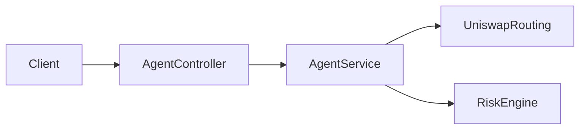

# Guardian DeFi Agent

Backend NestJS pour un **agent DeFi** orienté hackathon (ex. ETHGlobal Open Agent) : **moteur de risque** multicritère sur une intention de swap (quote Uniswap, simulation on-chain, heuristiques sécurité / social). **Aucune transaction n’est exécutée ni relayée** par cette API.

## Stack

- **NestJS** 11, TypeScript strict  
- **Viem** — simulation `eth_call` / `estimateGas` ; RPC = [PublicNode](https://publicnode.com/) pour les L1/L2 listées (évite merkle.io / rate limits), 0G = RPC officiel (`src/config/rpc-chain.config.ts`)  
- **Uniswap Labs Trade API** — `POST /v1/quote` puis `POST /v1/swap` ([documentation](https://api-docs.uniswap.org/))  
- **Swagger** — UI OpenAPI sur `/docs`

## Prérequis

- Node.js 18+ (recommandé 20+)
- npm
- Une **clé Uniswap Labs** ([Trade API](https://api-docs.uniswap.org/)) — obligatoire dans `.env` sous `UNISWAP_API_KEY`, sinon le serveur ne démarre pas.

## Installation et exécution

```bash
npm install
cp .env.example .env   # puis renseigne au minimum UNISWAP_API_KEY (obligatoire pour démarrer)
npm run start:dev
```

- API : `http://localhost:3000` (ou la valeur de `PORT`)  
- **Swagger** : `http://localhost:3000/docs`  
- Schéma OpenAPI JSON : `http://localhost:3000/docs/json`

### Scripts

| Commande        | Description        |
|-----------------|--------------------|
| `npm run build` | Compilation Nest   |
| `npm run start:dev` | Serveur watch  |
| `npm run start:prod` | `node dist/main` |
| `npm test`      | Tests Jest         |
| `npm run test:cov` | Couverture    |

## Endpoints HTTP

| Méthode | Chemin | Description |
|---------|--------|-------------|
| `GET`   | `/health` | Santé du service |
| `POST`  | `/v1/agent/swap/risk` | Quote Uniswap → évaluation risque (verdict, scores, simulation) |

Le corps de `/v1/agent/swap/risk` est validé par **Zod** (`nestjs-zod`) ; voir les exemples dans Swagger. Le serveur **ne démarre pas** sans **`UNISWAP_API_KEY`** dans l’environnement.

### Exemple `curl`

`UNISWAP_API_KEY` doit être présent dans `.env` (voir `.env.example`). L’URL du Trade API est **fixe** dans le code (`https://trade-api.gateway.uniswap.org`). Le champ **`swapper`** dans le JSON est **obligatoire** : wallet avec au moins **`amountIn`** de **`tokenIn`** et un **approve** routeur, sinon **`TRANSFER_FROM_FAILED`**.

```bash
curl -sS -X POST 'http://localhost:3000/v1/agent/swap/risk' \
  -H 'accept: application/json' \
  -H 'Content-Type: application/json' \
  -d '{
  "chainId": 1,
  "tokenIn": "0xA0b86991c6218b36c1d19D4a2e9Eb0cE3606eB48",
  "tokenOut": "0xC02aaA39b223FE8D0A0e5C4F27eAD9083C756Cc2",
  "amountIn": "1000000",
  "protocolId": "uniswap",
  "swapper": "0x…adresseChecksumméeAvecUsdcEtApprove…",
  "maxSlippagePercent": 0.5
}'
```

Un **`chainId`** non listé ci-dessous est rejeté avec **422** (`Unsupported chainId`).

### Chaînes EVM supportées

| `chainId` | Réseau |
|-----------|--------|
| 1 | Ethereum |
| 8453 | Base |
| 42161 | Arbitrum One |
| 10 | Optimism |
| 137 | Polygon |
| 56 | BNB Chain |
| 16661 | 0G Mainnet |
| 16602 | 0G Galileo Testnet |

## Variables d’environnement

| Variable | Rôle |
|----------|------|
| `PORT` | Port HTTP (défaut `3000`) |
| `RISK_MIN_AGGREGATE_SCORE` | Seuil agrégé du risk engine (défaut `60`) |
| **`UNISWAP_API_KEY`** | **Obligatoire** — sans elle le processus Nest quitte au chargement de la config. Clé Uniswap Labs (`x-api-key` ; gateway `https://trade-api.gateway.uniswap.org`, fixe dans le code). |

## Architecture (`src/`)

- **`agent`** — Quote adapter → `RiskEngine` (réponse JSON d’évaluation uniquement)  
- **`risk-engine`** — `SimulationService` (viem), evaluateurs (sécurité, social), agrégation des scores  
- **`protocol-adapters`** — Uniswap (`UniswapRoutingService` + registry)  
- **`config`** — `configuration`, `rpc-chain.config` (chaînes viem + RPC) ; **`common`** — erreurs, types

Flux simplifié :



## Uniswap — erreurs fréquentes

- **`No quotes available` (404)** : montant trop faible, paire non routée, ou paramètres incompatibles. Le backend renvoie désormais une **422** avec un message explicite plutôt qu’un 502 générique.  
- **Clé API** : `UNISWAP_API_KEY` **requise** au démarrage ; tous les quotes passent par le Trade API Uniswap.  
- **`swapper`** : champ **obligatoire** dans le JSON (wallet Uniswap Trade API).  
- **`maxSlippagePercent`** : optionnel — slippage max en **pourcentage** (ex. `0.5` pour 0,5 %), entre 0,01 et 50 ; défaut 0,5 % côté Uniswap. Le score « social » du risk engine est déduit côté serveur (impact prix / slippage du quote), pas par le client.

## Tests

```bash
npm test
```

Les tests couvrent notamment l’évaluation de risque et la sérialisation de la réponse API.

## Licence

Projet privé / hackathon — précise la licence si tu publies le dépôt.
