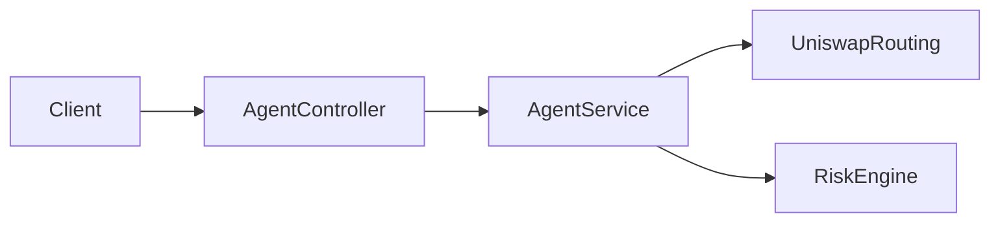

# Guardian DeFi Agent

Backend NestJS pour un **agent DeFi** orienté hackathon (ex. ETHGlobal Open Agent) : **moteur de risque** multicritère sur une intention de swap (quote Uniswap, simulation on-chain, heuristiques sécurité / social). **Aucune transaction n’est exécutée ni relayée** par cette API.

## Stack

- **NestJS** 11, TypeScript strict  
- **Viem** — simulation `eth_call` / `estimateGas` ; RPC = premier `http` des définitions `viem/chains` + 0G (`src/config/rpc-chain.config.ts`)  
- **Uniswap Labs Trade API** — `POST /v1/quote` puis `POST /v1/swap` ([documentation](https://api-docs.uniswap.org/))  
- **Swagger** — UI OpenAPI sur `/docs`

## Prérequis

- Node.js 18+ (recommandé 20+)
- npm

## Installation et exécution

```bash
npm install
# optionnel : crée un fichier .env à la racine (voir tableau des variables)
npm run start:dev
```

- API : `http://localhost:3000` (ou la valeur de `PORT`)  
- **Swagger** : `http://localhost:3000/docs`  
- Schéma OpenAPI JSON : `http://localhost:3000/docs/json`

### Scripts

| Commande        | Description        |
|-----------------|--------------------|
| `npm run build` | Compilation Nest   |
| `npm run start:dev` | Serveur watch  |
| `npm run start:prod` | `node dist/main` |
| `npm test`      | Tests Jest         |
| `npm run test:cov` | Couverture    |

## Endpoints HTTP

| Méthode | Chemin | Description |
|---------|--------|-------------|
| `GET`   | `/health` | Santé du service |
| `POST`  | `/v1/agent/swap/risk` | Quote Uniswap → évaluation risque (verdict, scores, simulation) |

Le corps de `/v1/agent/swap/risk` est validé par **Zod** (`nestjs-zod`) ; voir les exemples dans Swagger.

Un **`chainId`** non listé ci-dessous est rejeté avec **422** (`Unsupported chainId`).

### Chaînes EVM supportées

| `chainId` | Réseau |
|-----------|--------|
| 1 | Ethereum |
| 8453 | Base |
| 42161 | Arbitrum One |
| 10 | Optimism |
| 137 | Polygon |
| 56 | BNB Chain |
| 16661 | 0G Mainnet |
| 16602 | 0G Galileo Testnet |

## Variables d’environnement

| Variable | Rôle |
|----------|------|
| `PORT` | Port HTTP (défaut `3000`) |
| `RISK_MIN_AGGREGATE_SCORE` | Seuil agrégé du risk engine (défaut `60`) |
| `SIMULATION_FROM_ADDRESS` | Adresse `from` pour les `eth_call` de simulation + défaut `swapper` Uniswap |
| `UNISWAP_API_KEY` | Clé Uniswap Labs (header `x-api-key` vers le Trade API) |
| `UNISWAP_API_BASE_URL` | Base URL (défaut `https://trade-api.gateway.uniswap.org`) |
| `UNISWAP_SWAPPER_ADDRESS` | Wallet `swapper` par défaut si absent du JSON |
| `UNISWAP_ALLOW_STUB_FALLBACK` | `true` / `1` / `yes` — autorise un stub de quote **non réaliste** sans clé (démo uniquement) |

## Architecture (`src/`)

- **`agent`** — Quote adapter → `RiskEngine` (réponse JSON d’évaluation uniquement)  
- **`risk-engine`** — `SimulationService` (viem), evaluateurs (sécurité, social), agrégation des scores  
- **`protocol-adapters`** — Uniswap (`UniswapRoutingService` + registry)  
- **`config`** — `configuration`, `rpc-chain.config` (chaînes viem + RPC) ; **`common`** — erreurs, types

Flux simplifié :



## Uniswap — erreurs fréquentes

- **`No quotes available` (404)** : montant trop faible, paire non routée, ou paramètres incompatibles. Le backend renvoie désormais une **422** avec un message explicite plutôt qu’un 502 générique.  
- **Clé API** : obligatoire pour des quotes réelles, sauf mode `UNISWAP_ALLOW_STUB_FALLBACK` (déconseillé hors démo).  
- **`swapper`** : champ optionnel dans le body, sinon `UNISWAP_SWAPPER_ADDRESS`, sinon `SIMULATION_FROM_ADDRESS`.  
- **`maxSlippagePercent`** : optionnel — slippage max en **pourcentage** (ex. `0.5` pour 0,5 %), entre 0,01 et 50 ; défaut 0,5 % côté Uniswap. Le score « social » du risk engine est déduit côté serveur (impact prix / slippage du quote), pas par le client.

## Tests

```bash
npm test
```

Les tests couvrent notamment l’évaluation de risque et la sérialisation de la réponse API.

## Licence

Projet privé / hackathon — précise la licence si tu publies le dépôt.
